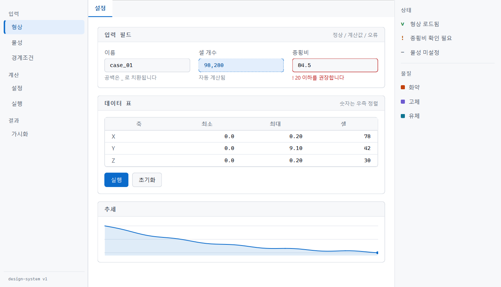

# PySide6 데스크톱 앱 디자인 시스템

과학·공학용 데스크톱 애플리케이션을 위한 UI 설계 방식과 재사용 코드입니다.
HESA(고압동력학 해석 GUI)에서 도출했으나 도메인 의존성이 없어 다른 프로젝트에 그대로 옮길 수 있습니다.



## 옮기는 방법

```bash
cp -r design-system/ <새프로젝트>/ui/
```

`tokens.py`의 색만 바꾸면 다른 앱이 됩니다. 위젯 코드는 손대지 않습니다.

```bash
python example.py          # 라이트
python example.py --dark   # 다크
python example.py --shot   # 두 테마 스크린샷
```

검증 환경: Python 3.11 · PySide6 6.11 · Windows 11

---

## 1. 설계 원칙

### 1.1 화면은 3분할한다

```
┌──────────┬────────────────────────┬──────────────┐
│ 작업 단계 │  작업 영역              │  정보 패널    │
│ (좌 190) │  (가변)                │  (우 230)    │
│          │                        │              │
│ 항상 표시 │  현재 단계의 입력·결과   │  상태·비용    │
└──────────┴────────────────────────┴──────────────┘
```

**왜** 기존 방식(단계마다 화면 전체 전환)은 사용자가 "지금 어디에 있는지",
"무엇이 남았는지"를 알 수 없게 만듭니다. 좌측 레일이 전체 절차를 상시 노출하고,
우측 패널이 현재 상태를 항상 보여주면 작업 맥락이 유지됩니다.

**적용** 단계가 5개 이상이고 순서가 있는 워크플로에 적합합니다.
단계가 2~3개면 과한 구조이니 탭으로 충분합니다.

### 1.2 색은 역할로 부르고, 값으로 부르지 않는다

```python
# 나쁨 — 다크 테마에서 전부 고쳐야 함
label.setStyleSheet("color: #4a5464")

# 좋음 — 테마가 바뀌면 자동으로 따라감
label.setStyleSheet(f"color: {T['ink2']}")
```

`surface`, `ink2`, `accent` 같은 **역할 이름**만 씁니다.
`blue`, `gray600` 같은 값 이름을 쓰면 다크 테마에서 이름과 실제가 어긋납니다.

위 두 스크린샷은 **동일한 위젯 코드**이며 `tokens.py`의 dict만 교체한 결과입니다.

### 1.3 정보 밀도를 높이되 계층을 만든다

공학 도구는 한 화면에 많은 값을 담아야 합니다. 여백으로 밀도를 낮추는 대신
**세 단계 잉크 농도**로 계층을 만듭니다.

| 토큰 | 용도 | 대비율 |
|---|---|---|
| `ink` | 값, 본문 | 17.8 |
| `ink2` | 라벨, 보조 설명 | 7.7 |
| `ink3` | 힌트, 단위 (없어도 되는 정보) | 3.9 |

`ink3`는 대비가 낮으므로 **필수 정보에 쓰지 않습니다.**

### 1.4 숫자는 고정폭으로 우측 정렬한다

```python
W.make_table(headers, rows, col_align=["l", "r", "r", "r"])
```

자릿수가 맞아야 크기 비교가 눈으로 됩니다. 지수 표기(`2.564e-3`)가 섞이는
공학 데이터에서 특히 중요합니다.

### 1.5 상태는 색만으로 표시하지 않는다

색각 이상 사용자(남성 약 8%)를 위해 **색 + 형태 + 텍스트**를 함께 바꿉니다.

| 상태 | 색 | 형태 | 텍스트 |
|---|---|---|---|
| 정상 | 기본 테두리 | 실선 | — |
| 계산값 | `accent` | **점선** 테두리 | "자동 계산됨" |
| 오류 | `crit` | 실선 + 굵기 | "! 20 이하를 권장합니다" |

### 1.6 계산값과 입력값을 구분한다

사용자가 고칠 수 있는 값과 시스템이 도출한 값은 다르게 보여야 합니다.
점선 테두리 + 읽기 전용으로 "이건 네가 못 고친다"를 형태로 전달합니다.

```python
W.Field("셀 개수", "98,280", computed=True)
```

---

## 2. 구성 파일

| 파일 | 역할 | 옮길 때 |
|---|---|---|
| `tokens.py` | 색·간격·타이포 정의 | **색만 교체** |
| `stylesheet.py` | 토큰 → QSS 생성 | 위젯 추가 시만 수정 |
| `widgets.py` | 재사용 위젯 | 그대로 |
| `example.py` | 최소 사용 예 | 복사해서 시작점으로 |

### 의존 방향

```
example.py  →  widgets.py  →  tokens.py
            →  stylesheet.py  ↗
```

`tokens.py`는 아무것도 import하지 않습니다. 그래서 교체가 안전합니다.

---

## 3. 제공 위젯

| 이름 | 용도 |
|---|---|
| `Field` | 라벨 + 입력 + 힌트/오류 한 덩어리 |
| `Group` | 제목 바가 있는 카드 |
| `make_table()` | 읽기 전용 데이터 표 |
| `Sparkline` | 추세만 보는 소형 그래프 |
| `Swatch` | 색 표식 |
| `label()`, `hline()` | 텍스트·구분선 |
| `make_icon()` | QPainter 아이콘 |

---

## 4. QSS의 한계 — 미리 알아야 할 것

QSS는 CSS의 부분집합입니다. **레이아웃과 색은 거의 그대로 되지만,
장식 효과는 QPainter로 내려가야 합니다.**

### 되는 것

`border-radius` · `:hover` · `:checked` · `[속성="값"]` 선택자 ·
`QProgressBar::chunk` 같은 서브컨트롤

### 안 되는 것과 대응

| CSS | QSS | 대응 |
|---|---|---|
| `::before` / `::after` | 없음 | 위젯으로 (`Swatch`) |
| `box-shadow` | 없음 | `QGraphicsDropShadowEffect` (성능 비용 있음) |
| `prefers-color-scheme` | 없음 | 토큰 dict 2벌 + 재생성 |
| SVG 배경 | 제한적 | `QIcon` 또는 `QPainter` |
| flex/grid | 없음 | `QLayout` |

### 반드시 지킬 것

```python
app.setStyle("Fusion")   # 없으면 OS 테마가 QSS를 덮어씀
```

Windows 기본 스타일은 일부 QSS를 무시합니다. Fusion으로 고정해야 OS 간 동일하게 보입니다.

---

## 5. 흔히 밟는 함정

실제로 겪은 것들입니다.

### 5.1 `&`가 사라진다

```python
QPushButton("Graphics & Animation")    # "Graphics _Animation" 으로 표시
QPushButton("Graphics && Animation")   # 정상
```

`QPushButton`은 `&`를 니모닉(단축키)으로 해석합니다.

### 5.2 절대좌표로 배지를 붙이면 어긋난다

```python
badge.move(170, 9)          # 버튼 폭이 바뀌면 깨짐
# 대신 버튼 내부 레이아웃 + addStretch() 로 Qt에 정렬을 맡깁니다
```

### 5.3 폰트를 QApplication 전에 조회하면 실패한다

```python
W.init_fonts()   # 반드시 QApplication() 생성 이후
```

`QFontDatabase`는 QApplication이 있어야 동작합니다.

### 5.4 폰트 스택은 실제 설치 여부를 확인해야 한다

`tokens.resolve_font()`가 설치된 첫 폰트를 반환합니다.
IBM Plex가 없으면 Segoe UI로 자동 대체됩니다.
번들하려면 `QFontDatabase.addApplicationFont()`를 씁니다.

---

## 6. 새 프로젝트 적용 절차

1. `design-system/`을 복사합니다.
2. `python example.py`로 동작을 확인합니다.
3. `tokens.py`의 **도메인 색**을 교체합니다
   (`explosive`/`solid`/`fluid` → 해당 프로젝트의 분류).
4. `python tokens.py`로 대비율을 확인합니다. 전부 OK여야 합니다.
5. `example.py`를 복사해 실제 화면을 만듭니다.

### 색을 바꿀 때 지킬 것

```bash
python tokens.py    # 바꾼 뒤 반드시 실행
```

WCAG AA(4.5:1) 미만이 나오면 그 색은 쓰지 않습니다.
`verify_contrast()`는 CI에 넣어 회귀를 막을 수 있습니다.

---

## 7. 검증 상태

두 테마 모두 `python tokens.py`로 대비율을 실측했습니다.

| 용도 | 라이트 | 다크 |
|---|---|---|
| 본문 | 17.76 | 14.68 |
| 보조 텍스트 | 7.65 | 8.13 |
| 힌트 | 3.90 | 3.79 |
| 강조 | 5.28 | 5.96 |
| 오류 | 6.47 | 5.19 |

힌트(`ink3`)는 3.x로 AA 미달이지만, 비필수 정보 전용이며 AA-large 기준은 충족합니다.
**필수 정보에는 쓰지 마세요.**

`shots/`의 두 이미지는 실제 실행 결과이며, 동일한 위젯 코드에서 토큰만 바꾼 것입니다.
